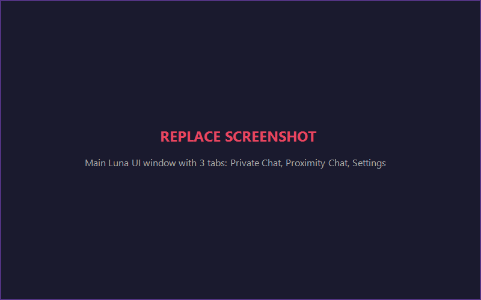
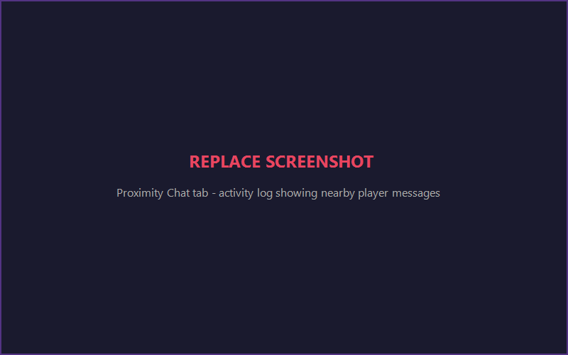
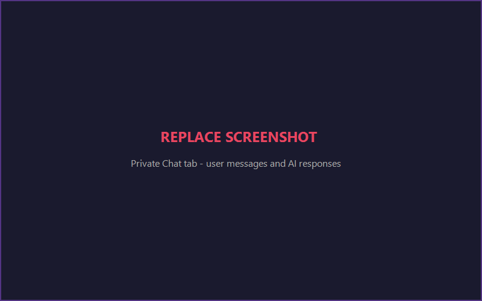
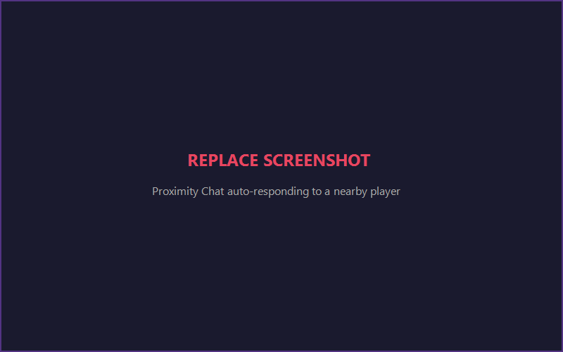
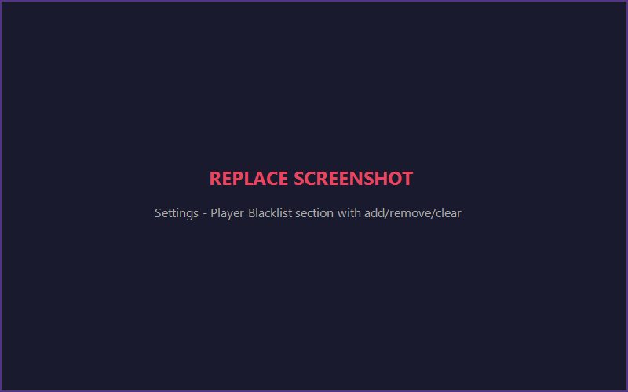
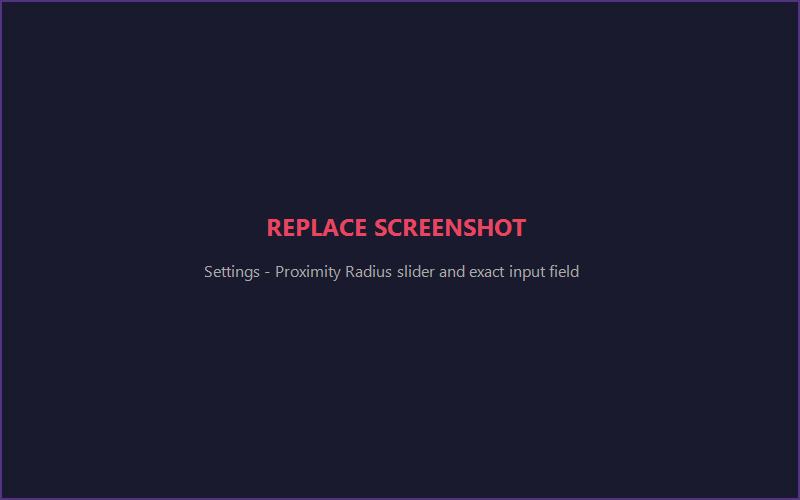

# Ollama AI Chat for Roblox

Chat with a local AI inside any Roblox game. Uses [Ollama](https://ollama.com/) running on your machine — no cloud APIs, no API keys, fully offline.



---

## Features

- **Private Chat** — Talk to the AI privately, responses only visible to you
- **Proximity Chat** — AI auto-responds to nearby players in game chat
- **15 Roleplay Presets** — Pirate, Knight, Wizard, Detective, Comedian, and more
- **Custom Prompts** — Write your own system prompt for any persona
- **Player Blacklist** — Block specific players the AI won't respond to
- **Adjustable Radius** — 5 to 500 studs, slider or exact number input
- **Works on any executor** — Synapse X, KRNL, Wave, Fluxus, etc.



---

## Prerequisites

1. **Ollama** installed and running — [Download](https://ollama.com/download)
2. At least one model pulled:
   ```bash
   ollama pull qwen2.5:7b
   ```
3. A **Roblox executor** that supports HTTP requests
4. **Luna Interface Suite** loaded by your executor (auto-loaded by the script)

---

## Setup

### 1. Start Ollama

Open the Ollama app or run:
```bash
ollama serve
```

### 2. Copy the script

Copy the entire contents of `ollama-roblox.lua` into your executor.

### 3. Execute

Run the script in any Roblox game. The Luna UI will appear with 3 tabs.

---

## How to Use

### Private Chat

1. Open the **Private Chat** tab
2. Type a message and press Enter
3. The AI responds privately — nobody else sees it
4. Use **Export Chat** to copy the conversation



### Proximity Chat

1. Open the **Proximity Chat** tab
2. Make sure **Auto-Respond** is ON in Settings
3. When a player near you chats, the AI automatically responds in game chat
4. The AI keeps context of the conversation



### Player Blacklist

1. Go to **Settings** → **Player Blacklist**
2. Use the dropdown to add players to the blacklist
3. The AI will NOT respond to blacklisted players
4. Use **Refresh Player List** to update the dropdown when players join/leave
5. **Blacklist All** blocks everyone in the server at once



### Radius Control

1. Go to **Settings** → **Proximity Chat**
2. Use the **slider** (5-500 studs) for quick adjustment
3. Or type an **exact value** (1-999) in the input field
4. The status bar shows your current radius and nearby player count



### Roleplay Presets

1. Go to **Settings** → **Roleplay Preset**
2. Pick a personality: Pirate Captain, Medieval Knight, Wizard, etc.
3. Or write your own **Custom Prompt** for full control

---

## Settings Reference

| Setting | Default | Description |
|---------|---------|-------------|
| Ollama URL | `http://localhost:11434` | Your Ollama server address |
| Model | `qwen2.5:7b` | Which model to use |
| Temperature | 0.7 | Creativity (0 = focused, 2 = wild) |
| Memory Length | 50 | How many messages to remember |
| Proximity Radius | 50 studs | Detection range |
| Response Delay | 1.5s | Delay before responding (feels natural) |
| Chat Prefix | `[AI]` | Prefix for AI messages in game chat |
| Auto-Respond | ON | Toggle proximity responses on/off |
| Typing Animation | ON | Show typing dots while waiting |

---

## Executor Compatibility

| Executor | HTTP Support | Status |
|----------|-------------|--------|
| Synapse X | `syn.request` | Working |
| KRNL | `http_request` | Working |
| Wave | `request` | Working |
| Fluxus | `fluxus.request` | Working |
| Script-Ware | `http_request` | Working |
| Delta | `http_request` | Working |

The script auto-detects your executor's HTTP function.

---

## Troubleshooting

| Problem | Fix |
|---------|-----|
| "Your executor does not support HTTP" | Your executor lacks HTTP support. Try a different one. |
| "Cannot connect to Ollama" | Make sure Ollama is running (`ollama serve` or open the app) |
| AI doesn't respond to nearby players | Check Auto-Respond is ON, radius is large enough, player isn't blacklisted |
| Luna UI doesn't load | Your executor may not support loadstring. Check executor docs. |
| Responses are slow | Larger models are slower. Try `qwen2.5:3b` for faster responses. |

---

## Configuration

Edit the top of `ollama-roblox.lua` to change defaults:

```lua
local OLLAMA_URL = "http://localhost:11434"

local Settings = {
    Model = "qwen2.5:7b",
    Temperature = 0.7,
    ProximityRadius = 50,
    ResponseDelay = 1.5,
    ProximityPrefix = "[AI]",
    AutoRespond = true,
}
```

---

## License

MIT
